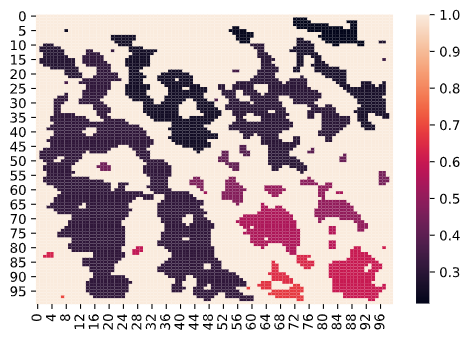
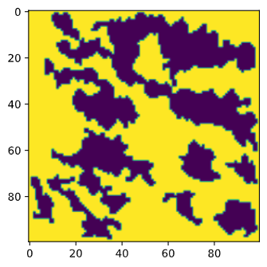
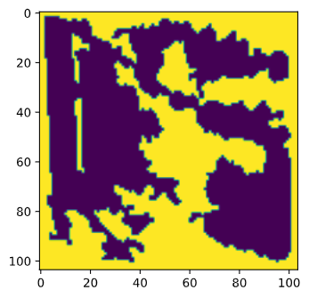

# CaveGeneratorInPython

Procedural Cave generation

* Created by *Ing. Alan Fernando Santacruz Rodríguez*

* Based on https://www.youtube.com/playlist?list=PLFt_AvWsXl0eZgMK_DT5_biRkWXftAOf9

Congratulations to the video Autor

You can see the Jupyter notebook to discover how the magic is happening

##  You can resume all the procedural creation on:

* Create a random matrix with 0 (Free space) and 1 (Wall), conserving the border.

  

* Soft the map, based on neighbor's  ceil in every one. P.D. you can select the iteration loops

  

* Find the regions

  

* Clean the regions that are so little

  

* Connect the regions, with a passage

  

## It's free to use only, pliss let us in the greetings and share this project, to build something more awesome

* You can help in the develop
* This project works, but if you find something that don't work, please be free to do it and upload it
* If you can help to this project with a donation, it will be so cool for us

	## Helpers of the project

* Sebastian League (Created for Unity 3D)
* Alan Fernando (Converted the C# code to Python code)

## Next steps

* Add the marching cubes 
* Upload the project as a python library

### If you want to help me with a coffee, pizza, or help to use it in your project you are free, please send me a message

